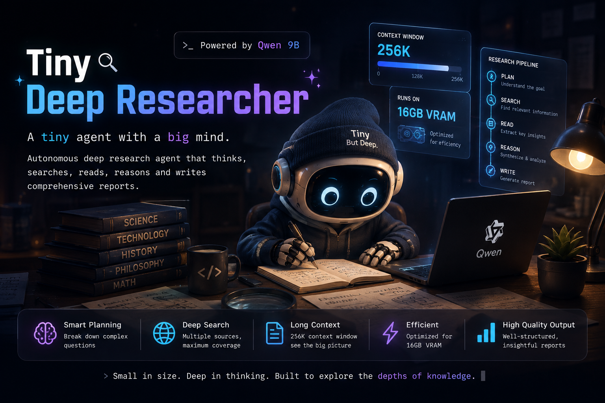
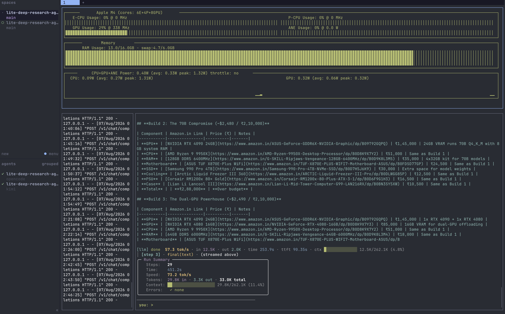

# Tiny Deep Researcher





General-purpose local agent with a **decorated tool registry** and a custom,
lightweight tool-calling loop (no LangGraph). The model answers questions by
calling tools — web search, page fetch, long-term memory — one JSON tool call
per turn, until it produces a final answer.

The LLM runs locally via an **OpenAI-compatible server** (`mlx_lm.server`,
Apple Silicon). Embeddings run **in-process** via HuggingFace
sentence-transformers. No cloud APIs, no Ollama.

## Prerequisites

- **Apple Silicon Mac** (M1/M2/M3/M4/M5) with ~16 GB unified memory
- **Python 3.10+**
- **`mlx-lm >= 0.31`** (older releases don't support the `qwen3_5` architecture)

## Quick Start

```bash
# 1. Install Python dependencies
pip install -r requirements.txt

# 2. Install / upgrade mlx-lm (the model needs a recent version)
pip install --upgrade mlx-lm

# 3. Start the LLM server (downloads the model on first run, ~5 GB)
mlx_lm.server \
  --model "Jackrong/MLX-Qwen3.5-9B-DeepSeek-V4-Flash-4bit" \
  --port 8080

# 4. In another terminal, run the agent
python -m research_agent
```

> **Note:** the server binds the port immediately and loads the weights lazily
> on the first request — silence after "Download complete" means it's ready,
> not stuck. The first generation request pays the model-load cost.

## Run

```bash
# Interactive REPL (type or pick a query); per-step tool calls are printed
python -m research_agent
```

Reports (final answers) are saved to `reports/report_<hash>.txt`.

## Architecture

A custom tool-calling loop (`agent.py: run()`), no agent framework:

```
user query
   │
   ▼
┌──────────────────────── agent.run() ─────────────────────────┐
│                                                              │
│   messages = [system prompt (tool catalog), user query]      │
│                    │                                         │
│                    ▼                                         │
│              ┌──────────┐   plain text                       │
│      ┌─────► │ llm.chat │ ──────────────►  FINAL ANSWER      │
│      │       └────┬─────┘                                    │
│      │            │  {"tool": "<name>", "args": {...}}       │
│      │            ▼                                          │
│      │     TOOL_REGISTRY[name](**args)                       │
│      │       web_search · fetch_page · recall_memory ·       │
│      │       remember · final_answer (ends the loop)         │
│      │            │                                          │
│      └────────────┘  tool result appended to messages        │
│                                                              │
│   loop capped at MAX_AGENT_STEPS (default 12)                │
└──────────────────────────────────────────────────────────────┘
                    │
                    ▼
   external world: DuckDuckGo · trafilatura · Chroma
   LLM: mlx_lm.server (OpenAI-compatible /v1, localhost:8080)
```

- **Tool registry** (`research_agent/tools/`) — decorating a function with
  `@tool` in any `tools/*.py` module is the only wiring needed; submodules
  are auto-discovered on package import. Built-in tools: `web_search`,
  `fetch_page`, `recall_memory`, `remember`, `final_answer`.
- **tools/base.py** — the original factories + helpers (`build_tools`,
  `run_ddg_search`, `fetch_url`, `_extract_json_object`, `count_tokens`, …),
  re-exported from `research_agent.tools`.
- **llm.py** — builds the system prompt from the tool catalog and parses the
  single-JSON tool call (`_extract_json_object` tolerates code fences).
- **Bad args / unknown tools** are caught and fed back to the model as the
  tool result; empty model output gets one nudge retry.

## Tech Stack

| Layer | Technology |
|---|---|
| Agent loop | Custom tool-calling loop (`agent.py`), no framework |
| Tool registry | `@tool` decorator + auto-discovery (`research_agent/tools/`) |
| LLM | `Jackrong/MLX-Qwen3.5-9B-DeepSeek-V4-Flash-4bit` via `mlx_lm.server` (OpenAI-compatible) |
| LLM client | `langchain_openai.ChatOpenAI` pointed at the local server |
| Embeddings | `sentence-transformers/all-MiniLM-L6-v2` in-process via `langchain_huggingface` (384d) |
| Vector DB | Chroma (persisted to `./advanced_memory/`) |
| Search | DuckDuckGo (`ddgs`) |
| Fetch | `trafilatura` (clean markdown) |
| Tracing | LangSmith (optional) |

## Configuration

Edit `.env` directly. Key settings:

```bash
# LLM (OpenAI-compatible server)
LLM_MODEL=Jackrong/MLX-Qwen3.5-9B-DeepSeek-V4-Flash-4bit
LLM_BASE_URL=http://localhost:8080/v1
LLM_API_KEY=not-needed
LLM_TIMEOUT=180               # seconds; LLM request timeout

# Embeddings (in-process)
EMBED_MODEL=sentence-transformers/all-MiniLM-L6-v2

# Search / fetch
SEARCH_RESULTS_PER_QUERY=8
MAX_PAGE_CHARS=5000
REQUEST_TIMEOUT=12

# Agent loop
MAX_AGENT_STEPS=12            # max tool-call turns per run
AUTO_FETCH_TOP_N=6            # top search hits fetched automatically (no extra LLM call)
AUTO_FETCH_MAX_TOTAL=14       # cap on auto-fetched pages per step

# Memory
MEMORY_DIR=advanced_memory
CHUNK_SIZE=1000
MEMORY_SIMILARITY_THRESHOLD=0.35
```

### LangSmith Tracing (optional)

```bash
LANGCHAIN_TRACING_V2=true
LANGCHAIN_API_KEY=<your-key>
LANGCHAIN_PROJECT=tiny-deep-researcher
```

## Memory Budget (Apple Silicon, 4-bit KV cache, approximate)

| Component | 64K ctx | 256K ctx |
|---|---|---|
| LLM weights (9B 4-bit, MLX) | ~5.3 GB | ~5.3 GB |
| KV cache (4-bit, 8 full-attn layers) | ~0.5 GB | ~2.0 GB |
| Linear-attention state (24 layers, fixed) | ~0.05 GB | ~0.05 GB |
| Embeddings (in-process, MiniLM) | 0.24 GB | 0.24 GB |
| Runtime overhead | 1.30 GB | 1.30 GB |
| **Total** | **~7.4 GB** | **~8.9 GB** |

> The model's native context is 262K (256K). Even the full window fits
> comfortably on a 16 GB Mac, so there's no need to cap context.

> **Performance:** this 4-bit 9B is much lighter and faster than the old 27B
> 2-bit, but multi-page research runs still take a while — that's the model,
> not the pipeline.

## Project Structure

```
tiny-deep-researcher/
├── HLD.md                  # High-Level Design document
├── handoff.md              # Project handoff reference
├── README.md               # This file
├── requirements.txt
├── .env                    # Configuration (edit directly)
│
├── research_agent/
│   ├── __init__.py         # re-exports run()
│   ├── __main__.py         # Entry point (loads .env, runs CLI)
│   ├── config.py           # All env-read constants (incl. MAX_AGENT_STEPS)
│   ├── agent.py            # run() — custom tool-calling loop
│   ├── llm.py              # system prompt + tool-call parsing
│   ├── memory.py           # Chroma add/query, Scratchpad
│   ├── logutil.py          # colors, previews, per-step tool-call logging
│   ├── tools/
│   │   ├── __init__.py     # @tool registry, auto-discovery, catalog, init_tools
│   │   ├── base.py         # original factories + helpers (was tools.py)
│   │   ├── web_search.py   # web_search tool (DuckDuckGo)
│   │   ├── fetch_page.py   # fetch_page tool (trafilatura)
│   │   ├── memory_tools.py # recall_memory / remember tools
│   │   └── finalize.py     # final_answer tool + sentinel
│   └── cli.py              # Interactive REPL, saves answer to reports/
│
└── scripts/
    ├── setup.sh            # pip install helper
    └── serve.sh            # Launch the LLM server
```
